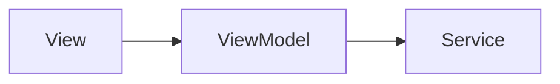

Write your introduction here.

## A code example

```swift
let message = "Hello, world!"
```

## A diagram


```mermaid
flowchart LR
  accTitle: Example architecture
  accDescr: A view sends events to a view model, which uses a service.
  View --> ViewModel --> Service
```

## An equation

Inline math: $E = mc^2$.

$$
\sum_{i=1}^{n} i = \frac{n(n+1)}{2}
$$
